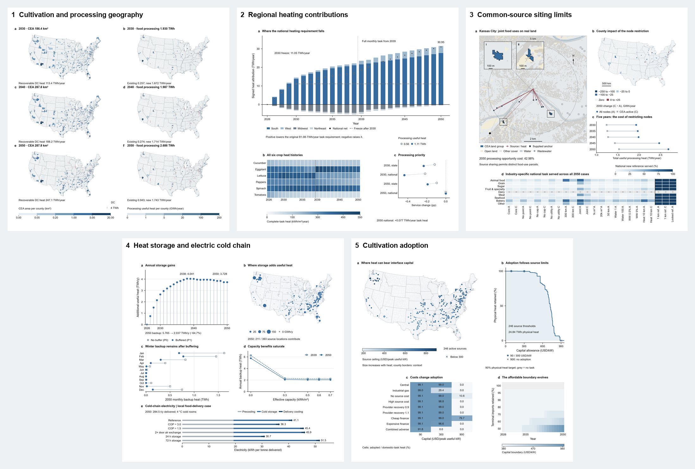
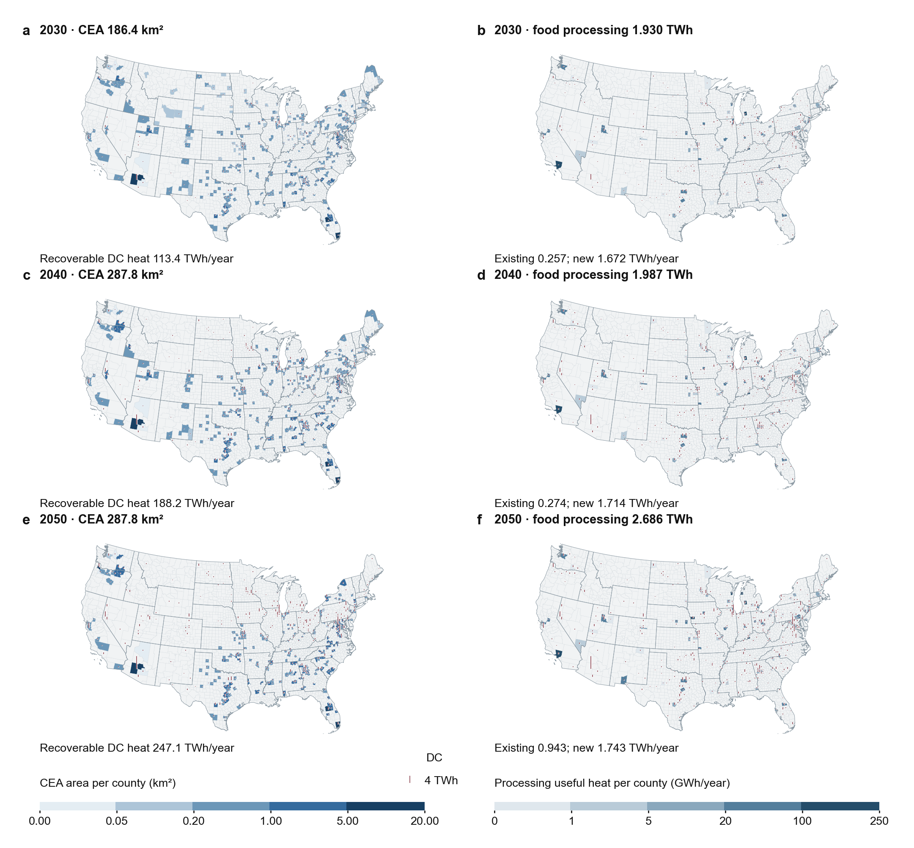
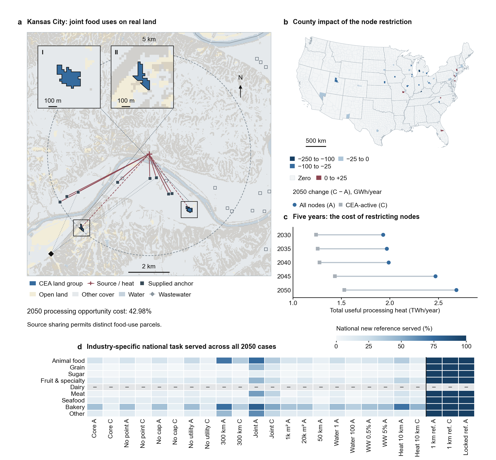
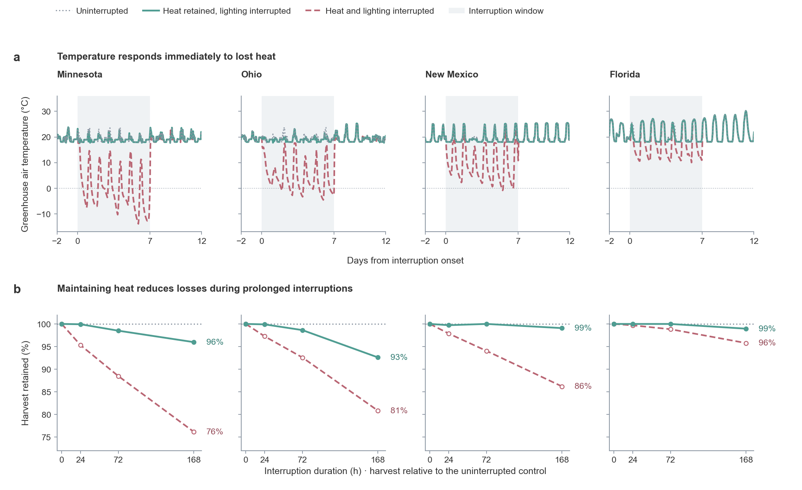

# Compute and Food

**Data-center expansion as energy–food infrastructure: a national systems model of the United States, 2026–2050**

Xiao Liu and Fengqi You · Cornell University

> **Research preview.** A manuscript is in preparation. This repository shows what the model
> contains and the current figures. The full code and data will be released with the paper.

## The question

The build-out of AI data centers is usually counted as a problem for the grid. But almost all the
electricity a data center uses leaves it as low-temperature heat, and food production needs exactly
that: greenhouses need warmth, and food manufacturers wash, cook and dry at temperatures a heat pump
can reach.

This project asks **how much of that growing heat resource can become useful heat for food, where,
at what cost, and what it takes for the service to survive an interruption.** It treats data
centers, the electricity system, controlled-environment agriculture (CEA), food processing and the
cold chain as **one interconnected infrastructure system** rather than five separate ones.

## What the model contains

| Layer | What it does | Built from |
|---|---|---|
| **Heat sources** | 393 data-center source cells on a 25 km grid, with modelled IT-capacity growth from 2026 to 2050 and recoverable heat at 53 °C | A public catalogue of US data-center campuses and announced projects; national capacity scenarios |
| **Food heat demand** | Hourly heat requests for protected crops in 48 states and for low-temperature food manufacturing (up to 70 °C) in 2,233 counties | USDA protected-crop area, NASA POWER hourly weather, NREL county manufacturing heat data |
| **Hourly dispatch** | Every source cell shares its hourly heat budget among the users connected to it. Heat pumps, pipe losses and full backup are accounted for, and energy is conserved in every cell and hour | [docs/MODEL.md](docs/MODEL.md) |
| **Siting** | New cultivation and processing capacity is placed by optimization under land, temperature and connection constraints, re-solved for every year | NLCD land cover, PAD-US protected areas, elevation, EPA facility registry; Gurobi, independently re-solved with HiGHS |
| **Storage and cold chain** | Intraday thermal buffering replayed over all 25 years; a local food-delivery case with precooling, cold rooms and refrigerated delivery | Project models |
| **Economics** | Break-even capital for the heat interface at every source, a gas and electricity price surface, and settlement among producers, interface investors and electricity providers | EIA reference prices; filed utility tariffs as separate billing checks |
| **Interruption** | Crop simulations of 24, 72 and 168 hour interruptions, with heat kept or lost, in four climates. County-level outage records place those durations in what has been observed | GreenLight crop model; DOE EAGLE-I outage records, 2014–2025 |

## Figures

### 1. Where can data-center heat meet food?

Selected cultivation area (left) and useful heat supplied to food processing (right) across 3,108
counties in 2030, 2040 and 2050. Burgundy bars mark recoverable heat at the 393 source cells, which
grows from 113 to 247 TWh per year. Processing service rises from 1.93 to 2.69 TWh per year. The
maps are annual planning configurations for post-2026 expansion, not a construction schedule.

### 2. What does placement do to the national heating requirement?

Where food is grown changes how much heat it needs. **a**, Regional contributions to the change in
the national crop-heating requirement for every year from 2026 to 2050; national monthly service
becomes complete in 2039. **b**, Heat intensity of the complete task for six crops over 25 years.
**c**, What happens to cultivation service when processing is given priority on the same sources.

### 3. What does real land allow, and what does sharing a source cost?

**a**, Kansas City, the source with the largest new processing heat among those that also supply
cultivation in 2050: real land cover and slope locate two admissible cultivation parcels and 21
industrial registry anchors, eight of which receive heat. Links are model connections, not surveyed
pipes. **b, c**, Restricting new processing to the sources that already serve cultivation costs 43%
of processing heat service in 2050. **d**, Share of each food industry's additional low-temperature
task that is served, across all 24 registered 2050 scenarios.

### 4. When is the heat needed? Storage, and the cold chain

**a–d**, Intraday heat buffering across all 25 years and all 393 sources. In 2050 it cuts backup
heat from 5.77 to 2.04 TWh per year, the gain saturates at a small buffer, and winter backup remains.
**e**, A separate local food-delivery case resolves precooling, cold storage and refrigerated
delivery, at 31 to 52 kWh of electricity per tonne delivered. Data-center heat serves cultivation
here; refrigeration stays electric, and the local account is not extrapolated nationally.

### 5. Who can afford the interface?

**a**, Break-even capital for the heat interface at each of 246 active sources, in USD per peak
useful kW. **b**, How much physically delivered heat survives as the capital requirement rises.
**c**, Adoption under nine operating and financing conditions and three capital levels: industrial
gas prices cut adoption sharply at 300 USD per kW, and only cheap finance makes 900 USD per kW
viable. **d**, How the affordable capital boundary moves with time and with the share of food
imports retained.

### 6. What does an interruption do to the crop?

Tomato crop simulations in four climates. **a**, Greenhouse air temperature through a week-long
interruption: with heat kept, every climate stays above 16.5 °C; with heat and lighting both lost,
temperatures fall below freezing for 150 of the 672 event hours, to −13.9 °C in Minnesota. **b**,
Harvest retained after 24, 72 and 168 hours. Temperature recovers within hours of service returning,
but the harvest deficit persists. The sub-freezing cases lie outside the crop model's validated
range, so their harvest contrasts are qualitative.

## An open question

The interruption experiments are deterministic stress tests: one failure passed from the grid to
heat to a crop. County-level outage records locate those durations in what has been observed (in the
2022 records, 98.2%, 99.7% and 99.9% of county outage streaks are no longer than 24, 72 and 168
hours), but the project has **no model of how often, for how long and in how many places at once
such interruptions occur.** Coupling this infrastructure model to a stochastic model of correlated
hazards is the natural next step.

## How to read these results

- **Everything shown is modelled.** Areas, heat, costs and harvests are scenario outputs, not
  measurements of operating projects.
- **Sources are regional proxies** derived from a public catalogue, not metered facilities.
- **Scenarios are deterministic.** No statistical uncertainty is attached to them.
- **Money** is mixed-vintage reference USD for the heat interface only, not whole-facility returns.
- **Negative and refuted results are kept** in the project record rather than removed.

## How the work is checked

- Every optimization is solved with Gurobi and independently re-solved or reconstructed.
- Each accepted experiment is built twice and the scientific outputs are compared byte for byte.
- Result cards are immutable: a changed number means a new experiment and a recorded decision.
- Measured, modelled and assumed quantities are labelled separately in every result.

More detail, with the governing equations, is in [docs/MODEL.md](docs/MODEL.md).

## Status, funding and contact

Manuscript in preparation. The working repository is private until submission; the code, source data
and a persistent archive will be released with the paper.

Supported by the Specialty Crop Research Initiative, award 2022-51181-38324, from the USDA National
Institute of Food and Agriculture.

Contact: Xiao Liu, [xl2372@cornell.edu](mailto:xl2372@cornell.edu)

© 2026 Xiao Liu and Fengqi You. Figures and text are shared for academic review; please do not reuse
them without permission. See [NOTICE.md](NOTICE.md).
