# Compute and Food

**Data-center expansion as energy–food infrastructure: a national systems model of the United States, 2026–2050**

Xiao Liu and Fengqi You · Cornell University

> **Research preview.** A manuscript is in preparation. This repository shows what the model
> contains and the current figures. The full code and data will be released with the paper.

## The question

The build-out of AI data centers is usually counted as a problem for the grid. But almost all the
electricity a data center uses leaves it as low-temperature heat, and food production needs exactly
that: greenhouses need warmth, and food manufacturers wash, cook and dry at temperatures a heat pump
can reach.

This project asks **how much of that growing heat resource can become useful heat for food, where,
at what cost, and what it takes for the service to survive an interruption.** It treats data
centers, the electricity system, controlled-environment agriculture (CEA), food processing and the
cold chain as **one interconnected infrastructure system** rather than five separate ones.

## What the model contains

| Layer | What it does | Built from |
|---|---|---|
| **Heat sources** | 393 data-center source cells on a 25 km grid, with modelled IT-capacity growth from 2026 to 2050 and recoverable heat at 53 °C | A public catalogue of US data-center campuses and announced projects; national capacity scenarios |
| **Food heat demand** | Hourly heat requests for protected crops in 48 states and for low-temperature food manufacturing (up to 70 °C) in 2,233 counties | USDA protected-crop area, NASA POWER hourly weather, NREL county manufacturing heat data |
| **Hourly dispatch** | Every source cell shares its hourly heat budget among the users connected to it. Heat pumps, pipe losses and full backup are accounted for, and energy is conserved in every cell and hour | [docs/MODEL.md](docs/MODEL.md) |
| **Siting** | New cultivation and processing capacity is placed by optimization under land, temperature and connection constraints, re-solved for every year | NLCD land cover, PAD-US protected areas, elevation, EPA facility registry; Gurobi, independently re-solved with HiGHS |
| **Storage and cold chain** | Intraday thermal buffering replayed over all 25 years; a local food-delivery case with precooling, cold rooms and refrigerated delivery | Project models |
| **Economics** | Break-even capital for the heat interface at every source, a gas and electricity price surface, and settlement among producers, interface investors and electricity providers | EIA reference prices; filed utility tariffs as separate billing checks |
| **Interruption** | Crop simulations of 24, 72 and 168 hour interruptions, with heat kept or lost, in four climates. County-level outage records place those durations in what has been observed | GreenLight crop model; DOE EAGLE-I outage records, 2014–2025 |

## Figures

Fourteen figures in six groups: the national picture, the three sectors in one place, real land,
timing, economics, and interruptions. All are model outputs; see [How to read these results](#how-to-read-these-results).

### The national picture

#### Where can data-center heat meet food?

Selected cultivation area (left) and useful heat supplied to food processing (right) across 3,108
counties in 2030, 2040 and 2050. Burgundy bars mark recoverable heat at the 393 source cells, which
grows from 113 to 247 TWh per year. Processing service rises from 1.93 to 2.69 TWh per year. The
maps are annual planning configurations for post-2026 expansion, not a construction schedule.

#### What does placement do to the national heating requirement?

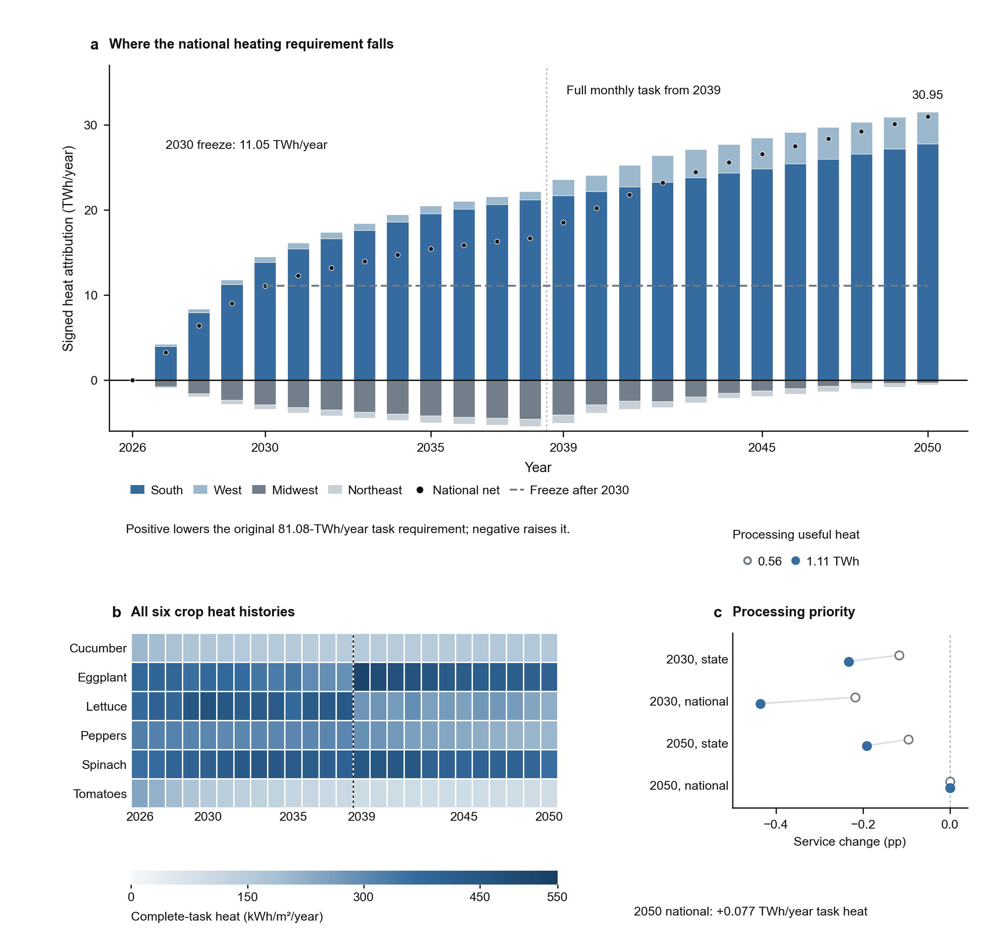

Where food is grown changes how much heat it needs. **a**, Regional contributions to the change in
the national crop-heating requirement for every year from 2026 to 2050; national monthly service
becomes complete in 2039. **b**, Heat intensity of the complete task for six crops over 25 years.
**c**, What happens to cultivation service when processing is given priority on the same sources.

### Data centers, cultivation and processing in one place

#### Three sectors on one map, 2030 to 2050

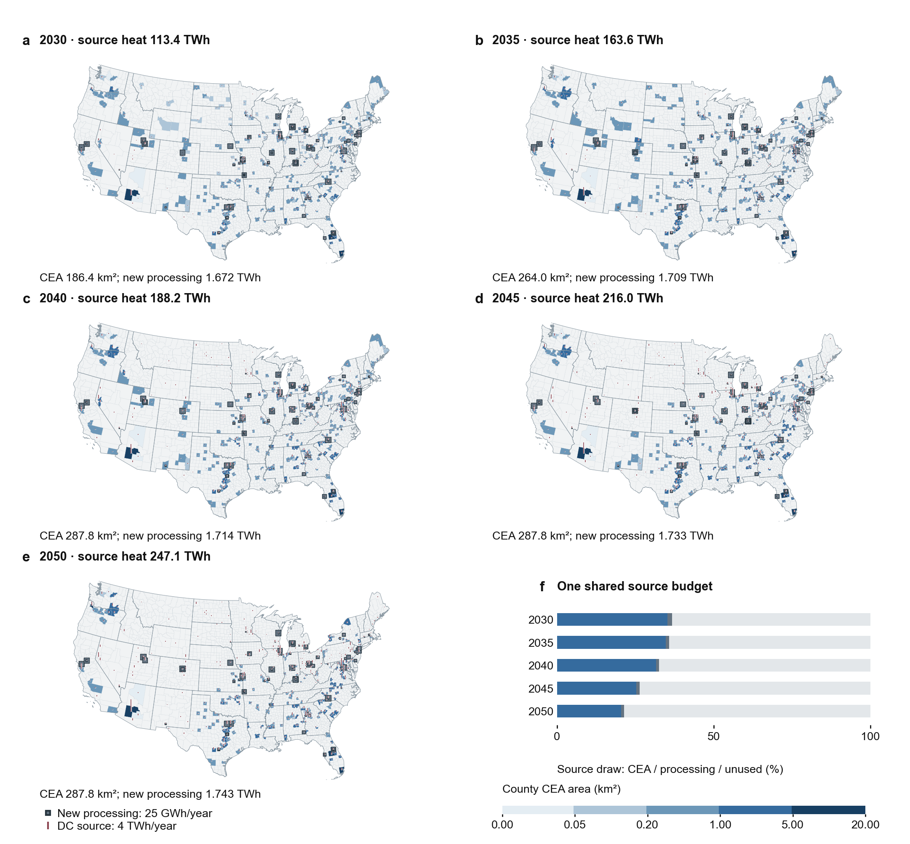

**a–e**, Five matched national configurations at five-year intervals. County fill is selected
cultivation area, grey squares are useful heat delivered to new food processing at industrial
anchors, and red bars are recoverable heat at the fixed data-center sources. Over the five
solutions, cultivation area grows from 186 to 288 km² and new processing heat from 1.67 to 1.74 TWh
per year, while gross source heat rises from 113 to 247 TWh per year. **f**, One shared source
budget: how each year's heat divides between cultivation, processing and unused heat.

#### Where the three already sit together today

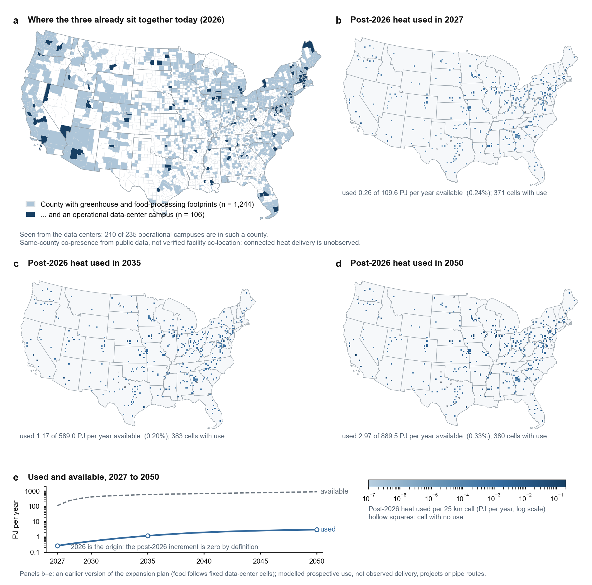

**a**, The 2026 reference screen: 1,244 counties have both a food-crop greenhouse footprint and a
food-processing footprint (light blue), and 106 of them also hold an operational data-center campus
(dark blue). Seen from the data centers, 210 of the 235 operational campuses are in such a county.
This is same-county co-presence from public data, not verified facility co-location, and connected
heat delivery is unobserved. **b–d**, Under an earlier version of the expansion plan, the post-2026
heat used in each 25 km source cell in 2027, 2035 and 2050. **e**, Used against available heat over
the period: a few tenths of one percent of the growing resource.

#### One source, two food uses, on real land

**a**, Kansas City, the source with the largest new processing heat among those that also supply
cultivation in 2050: real land cover and slope locate two admissible cultivation parcels and 21
industrial registry anchors, eight of which receive heat. Links are model connections, not surveyed
pipes. **b, c**, Restricting new processing to the sources that already serve cultivation costs 43%
of processing heat service in 2050. **d**, Share of each food industry's additional low-temperature
task that is served, across all 24 registered 2050 scenarios.

#### A complete local food chain: data center, greenhouse, packhouse, delivery

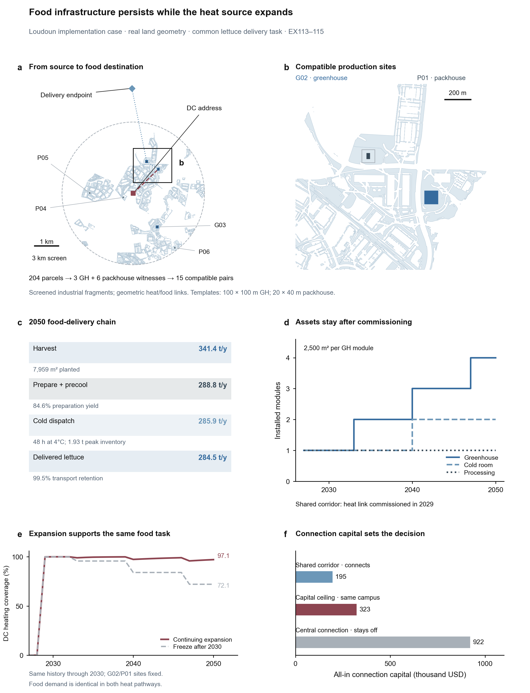

A Loudoun County, Virginia case built on real industrial-land geometry. **a, b**, Within 3 km of a
fixed data-center address, 204 screened parcels hold three greenhouse and six packhouse candidate
sites, giving 15 compatible pairs; G02 and P01 are selected. **c**, The 2050 delivery chain: 341 t of
harvest becomes 285 t of delivered lettuce through preparation, precooling, 48 h of cold storage at
4 °C and transport. **d**, Assets stay after commissioning: greenhouse modules, cold room and
processing line. **e**, Continued data-center expansion keeps 97% of the greenhouse's heating covered
in 2050, against 72% if expansion froze after 2030, for the same food task. **f**, Connection capital
decides whether the link is built: a shared corridor at 195 thousand USD connects in 2029, while the
central estimate of 922 thousand USD stays above the 323 thousand USD the same campus could bear.
Local conditions, not quotations.

### Real land: what a source can actually reach

#### Four counties, four mechanisms

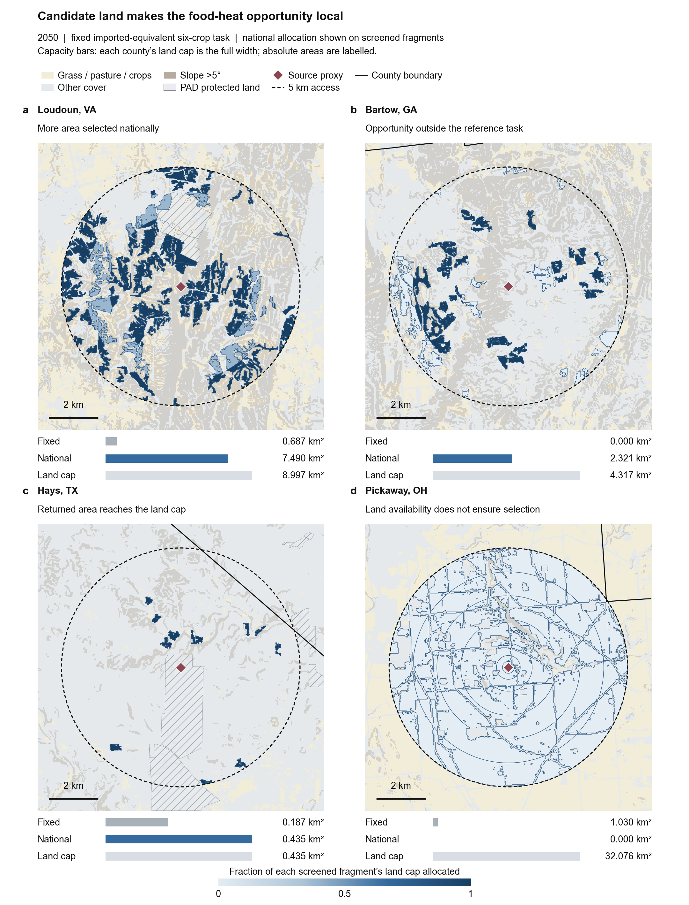

Each 12 × 12 km window shows a regional source, its assumed 5 km access radius, and every screened
land fragment (30 m land cover, slope, and PAD-US protected areas), with blue intensity giving the
share of each fragment's greenhouse capacity that the national optimization allocates. Bars compare
a fixed state-share allocation, the national allocation and the county's land cap. **a**, Loudoun,
Virginia: the national solution selects far more area than the state share (7.5 versus 0.7 km²).
**b**, Bartow, Georgia: 2.3 km² selected where the reference allocation had none. **c**, Hays, Texas:
the returned area reaches the land cap. **d**, Pickaway, Ohio: nothing is selected although 32 km² of
land is available. Polygons are whole fragments, not building footprints.

#### How the allocation moves between 2030 and 2050

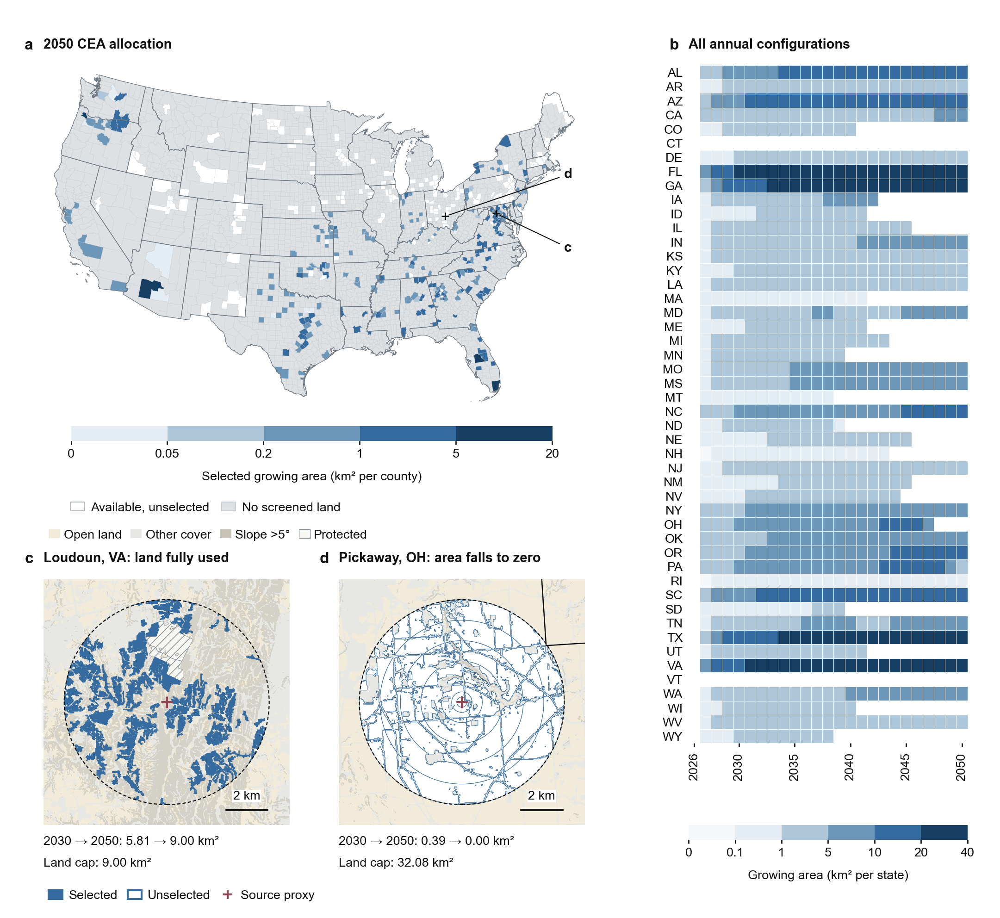

**a**, The 2050 configuration across all 3,108 counties: blue is allocated growing area, white is
screened land left unused, grey has no screened land. **b**, Allocated area in every state for each
of the 25 independently solved years. **c, d**, Two windows chosen by the results themselves: Loudoun
grows to fill its county land cap (5.8 to 9.0 km²), while Pickaway's allocation falls from 0.4 km²
to zero although land remains. Annual planning alternatives, not a construction history.

#### What continued expansion changes at one source: Arizona

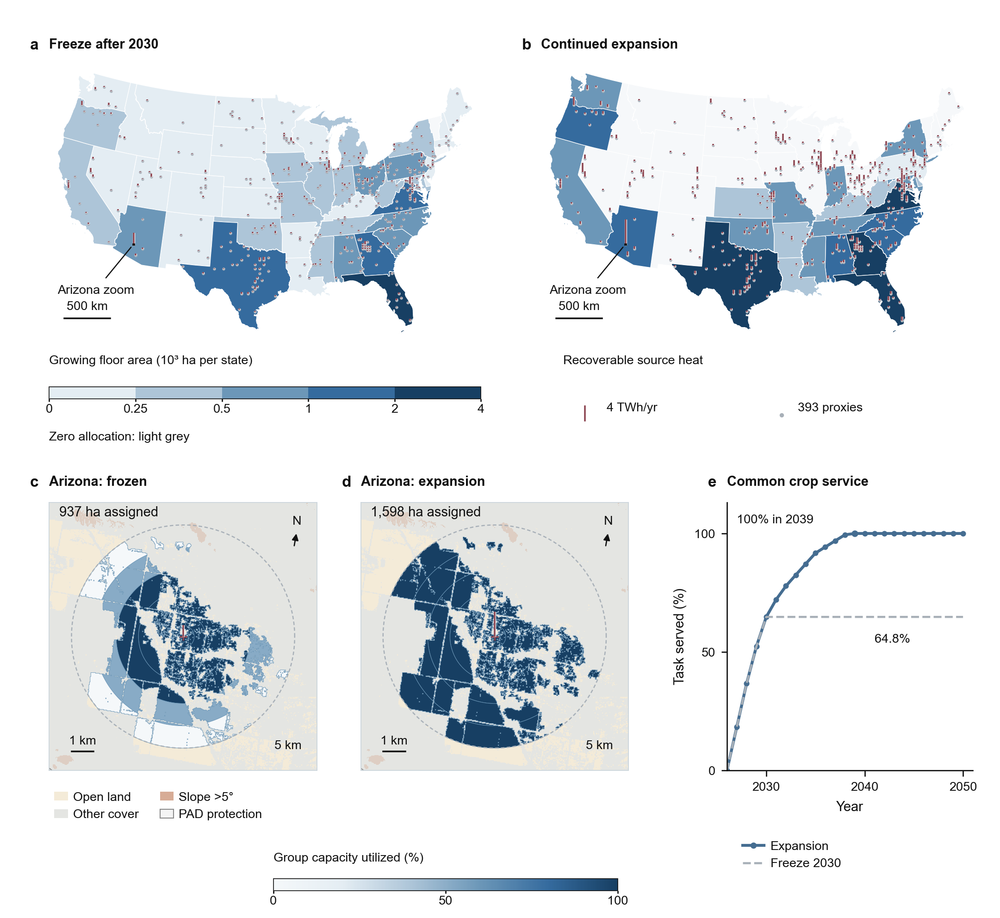

**a, b**, The 2050 plan with source growth frozen after 2030 and with growth continuing. **c, d**, The
same 12 × 12 km Arizona window, chosen for the largest change in assigned area: 151 screened
fragments in seven allocation groups, with 937 ha assigned under the freeze and 1,598 ha under
expansion. **e**, Nationally, the common crop task is fully served by 2039 with expansion, and stays
at 65% if sources freeze.

### Timing: storage and the cold chain

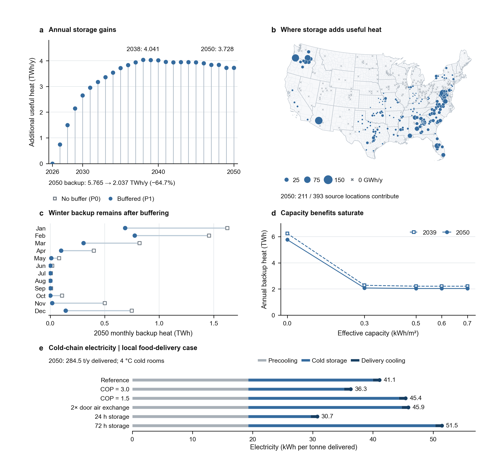

**a–d**, Intraday heat buffering across all 25 years and all 393 sources. In 2050 it cuts backup
heat from 5.77 to 2.04 TWh per year, the gain saturates at a small buffer, and winter backup remains.
**e**, A separate local food-delivery case resolves precooling, cold storage and refrigerated
delivery, at 31 to 52 kWh of electricity per tonne delivered. Data-center heat serves cultivation
here; refrigeration stays electric, and the local account is not extrapolated nationally.

### Who can afford the interface?

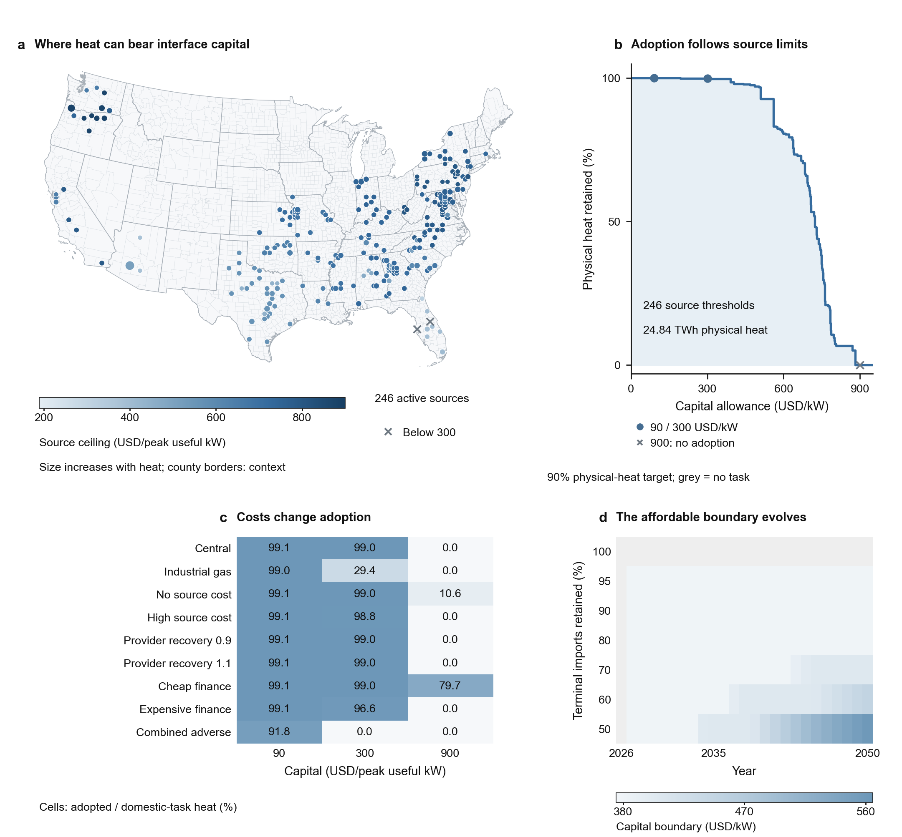

**a**, Break-even capital for the heat interface at each of 246 active sources, in USD per peak
useful kW. **b**, How much physically delivered heat survives as the capital requirement rises.
**c**, Adoption under nine operating and financing conditions and three capital levels: industrial
gas prices cut adoption sharply at 300 USD per kW, and only cheap finance makes 900 USD per kW
viable. **d**, How the affordable capital boundary moves with time and with the share of food
imports retained.

### Interruptions and resilience

#### What does a week without power do to a crop?

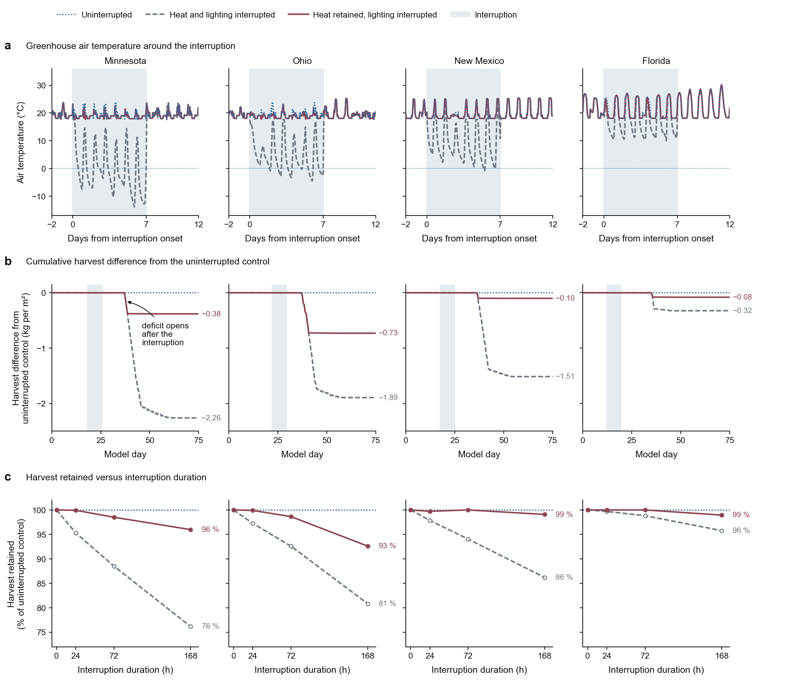

Tomato crop simulations in four climates. **a**, Greenhouse air temperature through a week-long
interruption: with heat kept, every climate stays above 16.5 °C; with heat and lighting both lost,
temperatures fall below freezing for 150 of the 672 event hours, to −13.9 °C in Minnesota. **b**,
Cumulative harvest against the uninterrupted control over the 75-day cycle: the deficit opens after
the interruption and never closes, reaching 2.3 kg per m² in Minnesota with heat lost and 0.4 kg per
m² with heat kept. **c**, Harvest retained after 24, 72 and 168 hours. The sub-freezing cases lie
outside the crop model's validated range, so their harvest contrasts are qualitative.

#### Duration, climate and timing: the full matrix

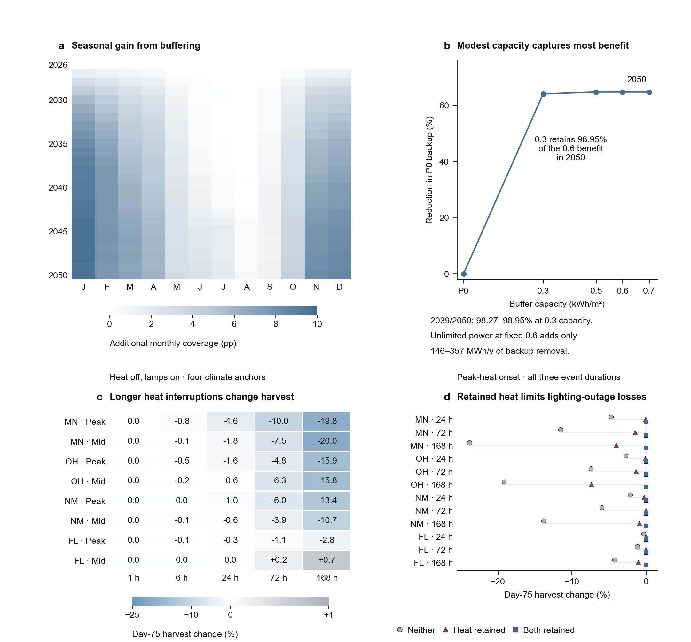

**a, b**, Intraday buffering, month by month for 25 years: the gain is a winter effect, and a
0.3 kWh/m² buffer retains 99% of what a 0.6 kWh/m² buffer achieves. **c**, All 40 heat-only
interruptions: four climates, two onset times and durations from 1 to 168 hours, as the change in
day-75 harvest against each climate's uninterrupted control. One hour costs nothing anywhere; a
week at peak heating costs 20% of the harvest in Minnesota and 3% in Florida. **d**, The 36
peak-onset cases by what is kept running: neither, heat only, or heat and lighting. Keeping heat
alone recovers most of the loss.

#### Placing the stresses against observed outages

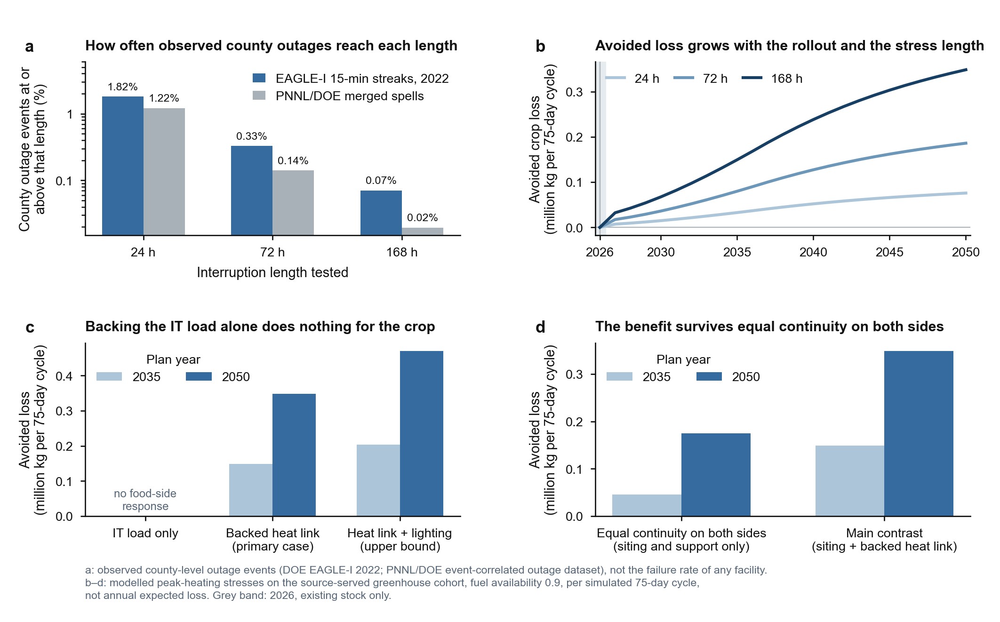

**a**, Observed county-level outage durations from DOE EAGLE-I 15-minute records and the PNNL/DOE
merged event dataset: about 1.8% of county outage streaks reach 24 hours, 0.3% reach 72 hours and
0.07% reach a week. These place the tested durations in the observed distribution; they are county
events, not the failure probability of any facility. **b**, Under an earlier version of the plan,
the crop loss avoided by a backed heat link grows with the food rollout and with the stress length.
**c**, Backing only the data center's IT load gives the crop nothing; the heat link itself must be
backed. **d**, The benefit survives when both sides are given equal continuity. Conditional
per-cycle quantities, not annual expected losses.

## An open question

The interruption experiments are deterministic stress tests: one failure passed from the grid to
heat to a crop. The outage records locate those durations in what has been observed, but the project
has **no model of how often, for how long and in how many places at once such interruptions occur,
or of the weather that drives them.** Coupling this infrastructure model to a stochastic model of
correlated hazards is the natural next step.

## How to read these results

- **Everything shown is modelled.** Areas, heat, costs and harvests are scenario outputs, not
  measurements of operating projects.
- **Sources are regional proxies** derived from a public catalogue, not metered facilities.
- **Polygons on the local maps are screened land fragments**, not building footprints, and the
  links are model connections, not surveyed pipes.
- **Scenarios are deterministic.** No statistical uncertainty is attached to them.
- **Money** is mixed-vintage reference USD for the heat interface only, not whole-facility returns.
- **Figures come from several stages of the model.** The national maps in the first two groups and
  the storage and economics figures use the current national solutions; the county co-presence and
  outage-records figures come from an earlier plan version and are shown for their own content.
- **Negative and refuted results are kept** in the project record rather than removed.

## How the work is checked

- Every optimization is solved with Gurobi and independently re-solved or reconstructed.
- Each accepted experiment is built twice and the scientific outputs are compared byte for byte.
- Result cards are immutable: a changed number means a new experiment and a recorded decision.
- Measured, modelled and assumed quantities are labelled separately in every result.

More detail, with the governing equations, is in [docs/MODEL.md](docs/MODEL.md).

## Status, funding and contact

Manuscript in preparation. The working repository is private until submission; the code, source data
and a persistent archive will be released with the paper.

Supported by the Specialty Crop Research Initiative, award 2022-51181-38324, from the USDA National
Institute of Food and Agriculture.

Contact: Xiao Liu, [xl2372@cornell.edu](mailto:xl2372@cornell.edu)

© 2026 Xiao Liu and Fengqi You. Figures and text are shared for academic review; please do not reuse
them without permission. See [NOTICE.md](NOTICE.md).
